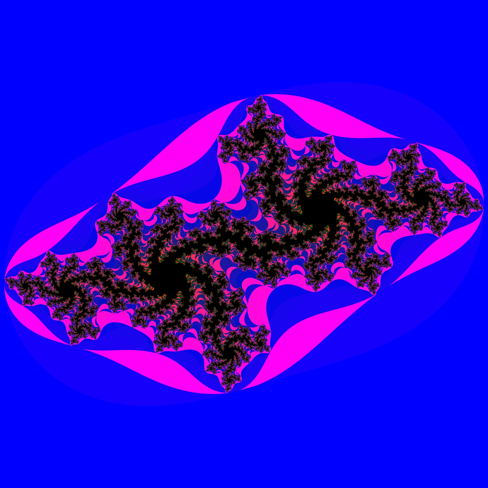

# Complex Dynamical Systems

This is a repo of my experimentatoin with julia sets and the mandelbrot set.

## Resources
* A good [introduction](https://users.math.yale.edu/public_html/People/frame/Fractals/MandelSet/welcome.html).
* Paul Bourke's [website](http://paulbourke.net/fractals/) that has a fractals section. The site also has a lot of other cool stuff.

# Gallery

